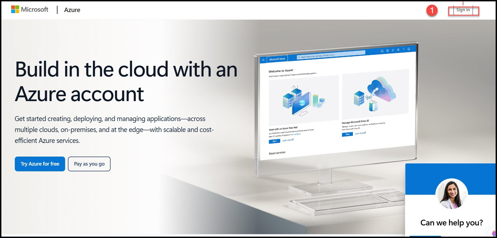
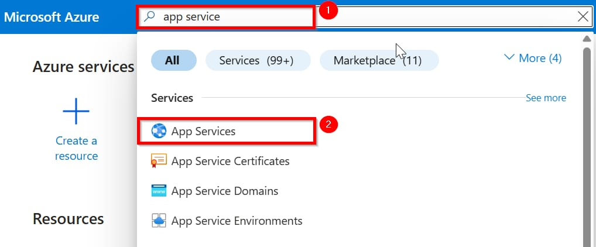
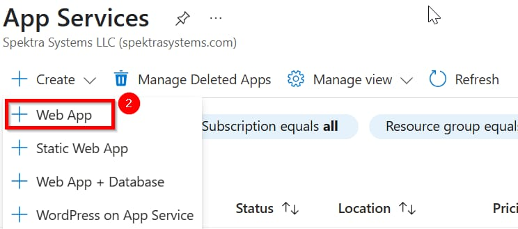

# Lab Guide: Creating Azure App Services Using Portal

## Objective
Deploy a simple Python web application using Azure App Service via Azure Portal.

---

## Prerequisites
- Active Azure subscription
- Basic knowledge of Python (Flask app)
- A simple Python web app ready on your computer (app.py + requirements.txt)

---

## Steps

### Step 1: Log in to Azure Portal
- Go to [https://portal.azure.com](https://portal.azure.com)
- Sign in with your Azure credentials.

---

### Step 2: Create a Resource Group (if needed)
- In the search bar, type **Resource Groups**.
- Click **+ Create**.
- Enter:
  - **Resource Group Name**: `myResourceGroup`
  - **Region**: `East US` (or a region close to you)
- Click **Review + Create** > **Create**.
- 

### Step 3: Create a Web App
- In the search bar, type **App Services**.
- 
- Click **+ Create** > **Web App**.
- 
- Enter:
  - **Subscription**: Your active subscription
  - **Resource Group**: `myResourceGroup`
  - **Name**: `my-python-webapp` (must be globally unique)
  - **Publish**: `Code`
  - **Runtime Stack**: `Python 3.11`
  - **Operating System**: `Linux`
  - **Region**: Same as Resource Group
  - **App Service Plan**: Select `myAppServicePlan`
- Click **Review + Create** > **Create**.

---

