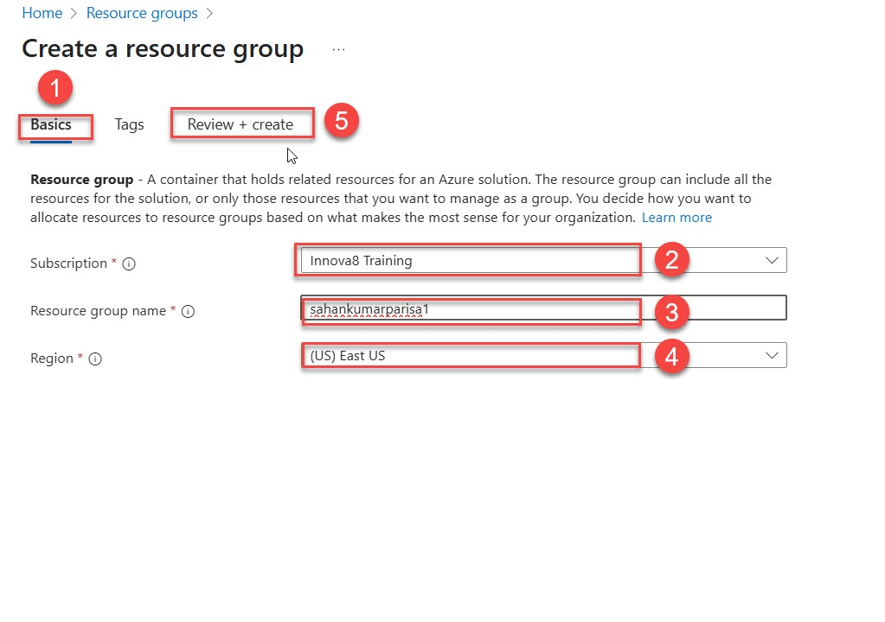

# Lab Guide: Creating Azure App Services Using Portal

## Objective
Deploy a simple Python web application using Azure App Service via Azure Portal.

---

## Prerequisites
- Active Azure subscription
- Basic knowledge of Python (Flask app)
- A simple Python web app ready on your computer (app.py + requirements.txt)

---

## Steps

### Step 1: Log in to Azure Portal
- Go to [https://portal.azure.com](https://portal.azure.com)
- Sign in with your Azure credentials.

---

### Step 2: Create a Resource Group (if needed)
- In the search bar, type **Resource Groups**.
- Click **+ Create**.
- Enter:
  - **Resource Group Name**: `myResourceGroup`
  - **Region**: `East US` (or a region close to you)
- Click **Review + Create** > **Create**.
- 

### Step 3: Create a Web App
- In the search bar, type **App Services**.
- 
- Click **+ Create** > **Web App**.
- 
- Enter:
  - **Subscription**: Your active subscription
  - **Resource Group**: `myResourceGroup`
  - **Name**: `my-python-webapp` (must be globally unique)
  - **Publish**: `Code`
  - **Runtime Stack**: `Python 3.11`
  - **Operating System**: `Linux`
  - **Region**: Same as Resource Group
  - **App Service Plan**: Select `myAppServicePlan`
- Click **Review + Create** > **Create**.
- 
- 

---
### step 4 : go to deployment
- In the deployment you will be seeing the first option of continuous deployment which is disabled you have click on the enable
- choose the github account
- choose organization
- choose repository
- choose branch 

### step 5: review and create 
- the remaining fields can be kept as they are you need not change any configuration in it
- review all the fields in the app services make sure all fields are as per you requirment
- after reviewing you can click on the create button
- then your depployment will be starting
- after it is deployed you should click on the resoures
 
 

---
### step 6: Go to your app service
- first in the search bar type app services
- then find you app service name which you have given to it
- after click on click on default domain where you will able to  see your web app
 
 
- you will redirected to your web which will apper like this
 

